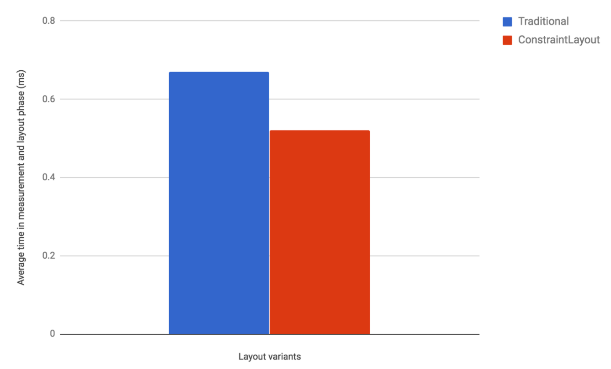
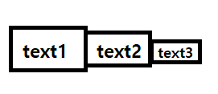

ConstraintLayout - [출처 - dev님의 tistory](https://recipes4dev.tistory.com/158), [안드로이드 공식문서](https://developer.android.com/reference/android/support/constraint/ConstraintLayout)
===
* constraint == 강제, 제약 이라는 뜻을 가진다.
  * 제약(Constraint)"이란, 각 요소들의 최종 위치와 크기를 결정하게 될 조건이다.
* View Widget 의 위치와 크기를 **유연하게** 조절할 수 있게 만들어주는 레이아웃이다
* **장점**
  * 유지보수 및 성능이 다 빠르다.
    * 
  * relative layout에서 4 depth이상 들어가야하는 것도 1 depth로 가능하다.
  * 기존의 많은 기능들이 deprecated 되어서 constraintlayout이 유일한 대안이다.
* layout_constraint[제약조건]의 형식을 가진다.
* **많은 수의 제약조건들을 가지고 있다.**
* |||
  |----|----|
  |Relative positioning|요소 간 상대 위치 지정 (left, right, top, bottom, start, end, baseline)|
  |Margins|요소 간 여백(Margin) 설정을 위한 제약|
  |Centering positioning|뷰를 부모 레이아웃 또는 제약 영역의 중앙에 배치|
  |Circular positioning|대상 뷰를 기준으로 각도(angle)와 반지름(radius)으로 상대 위치 지정|
  |Visibility behavior|뷰의 Visibility 상태에 따른 최종 위치 결정 및 여백|
  |Dimension constraints|뷰에 적용된 제약에 따른 뷰의 크기(Dimension) 결정|
  |Chains|수평 또는 수직 방향(Axis)으로 나열된 뷰에 대한 그룹화. 배치 스타일 지정|
  |Virtual Helpers objects|레이아웃 내 효율적인 뷰 배치에 사용 가능한 몇 가지 Helper 객체들 (Guideline, Barrier, Group)|
  |Optimizer|제약 카테고리에 대한 최적화|

* 만약 모든 자식(Children) 뷰가 **어떠한 제약도 가지지 않는다면**, 컨스트레인트레이아웃에 포함된 뷰들은 모두 레이아웃 영역의 **왼쪽 위를 기준으로 배치된다.** 
  * 그렇기 때문에 나중에 추가된 뷰가 앞서 작성된 뷰를 덮어버리게 된다.
  * 컨스트레인트레이아웃을 사용할 때는 **자식(Children) 뷰에 반드시 하나 이상의 제약(또는 수평, 수직 방향에 대한 양 방향 위치 제약)을 적용**해야 한다.

* 크기조정
  * 연속적인 TextView 만들기
    ```xml
    <TextView
      android:layout_width="wrap_content"
      android:layout_heigh="wrap.......
      ...
      android:id="@+id/text1"
      .. />
                            
    <TextView
      android:layout_widht="0dp"
      android:layout_height="wrap_content"
      ...
      ..
      app:layout_constraintLeft_toRightOf="@id/text1"
      app:layout_constraintRight_toRightOf="parent" /> <!-- <= 이 Contraint에 조건을 맞춘다는뜻이다.-->
  * **0dp**
    * 크기를 dp와 같은것이 아닌 제약(MATCH_CONSTRAINT)에 맞춘다는 뜻이다.
                                                   
layout_gravity
---
* 컨스트레인트레이아웃에서는 "layout_gravity" 속성이 적용되지 않는다. 
* **컨스트레인트레이아웃에서는 제약(Constraint)을 통해 뷰의 위치가 결정 "gravity"와 같은 개념은 무의미**
                                                          
Margins
---
* ConstraintLayout 에서의 사이드 Margin 은 기존의 있던 layout_margin 속성들을 그대로 사용하여 적용한다.
* 
                                                         
상대위치지정
---
* Relative Layout과의 차이점
  * Relative Layout
     * 전부다 다른 영역에서 따로따로 존재한다.
       * 자식 뷰 간 상대 위치
       * 자식 뷰와 부모 간 상대 위치
       * 맞춤 정렬(Alignment) 등에 대한 속성 
  * ConstraintLayout
     * "자식 뷰 간 상대 위치"와 "자식 뷰와 부모 간 상대 위치"를 동일한 속성을 통해 지정 가능하다.
     * **맞춤 정렬(Alignment)을 위한 속성이 별도로 존재하지 않는다**는 차이가 있다.
* 속성
  * layout_constraint[SIDE1]_to[SIDE2]Of
     * 내 Side1 쪽에 있는놈 위치를 기준으로 side2 로 이동한다.
  * 
  * 부모 layout 도 똑같이 적용된다.
    * ```xml
      android:"@+id/A
      ...Left_toLeftOf="parent"
* baseline 기준으로 뷰정렬시 baseline 의미
  * [출처 - recipes4dev님의 tistory](https://recipes4dev.tistory.com/161?category=658689)
  * 
  * .xml
    ```xml
    <android:support.constraint.ConstraintLayout ... ..>          
              
    <TextView ... ..
      android:id="@+id/text1"
      android:text="TEXT1"
      app:layout_constraintLeft_toLeftOf="parent"
      app:layout_constraintTop_toTopOf="parent" />

    <TextView ... ..
      android:id="@+id/text2"
      android:text="TEXT2"
      app:layout_constraintLeft_toRightOf="@+id/text1"
      app:layout_constraintBaseline_toBaselineOf="@id/text1" />

    <TextView ... ..
      android:id="@+id/text3"
      android:text="TEXT3"
      app:layout_constraintLeft_toRightOf="@+id/text2"
      app:layout_constraintBaseline_toBaselineOf="@id/text1" />

    </android.support.constraint.ConstraintLayout>
  * 
