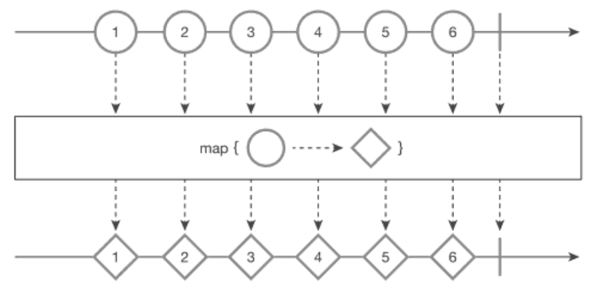

map() 함수
===
* **입력값을** 어떤 함수에 넣어서 **원하는 값**으로 **변환**하는 함수이다.
  * ex) String -> String, String -> Integer, 객체 A -> 객체 B
  * 핵심은 **"어떤 함수에 넣어서"** 이다.
* 입력 데이터 <-- map() --> 변환 함수 (**중개업자와 같은 역할**)
* marblediagram
  * 
* .java
  ```java
  public static String getDiamond(String ball) {
    return ball + "◇";
  }
  
  // using Rxjava
  String[] balls = {"1", "2", "3", "5"};
  Observable<String> source = Observable.fromArray(balls)
    .map(ball -> ball + "◇");
  source.subscribe(Log::i);
 
* map 함수 원형
  * .java
    ```java
    @CheckReturnValue // 반환값을 확인한다. 대부분 연산자에서 사용
    @SchedulerSupport(value="none") // 스케쥴러 지원하지 않는다는 의미
    public final <R> Observable<R> map(Function<? super T, ? extends> mapper)

    // map() 함수의 인자인 Function
    Function<? super T, ? extends R> mapper
