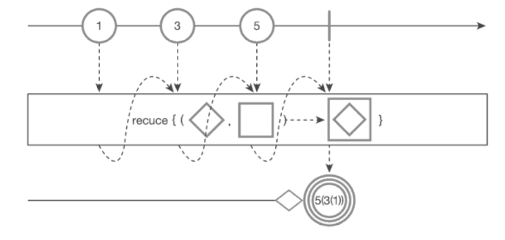

reduce()
===
* 발행한 데이터를 모두 사용하여 어떤 최종결과를 합산할때 활용
* marblediagram
  * 
* ```java
  String[] balls = {1, 3, 5};
  Maybe<String> source = Observable.fromArray(balls)
    .reduce((ball1, ball2) -> ball2 + "(" + ball1 + ")");
  source.subscribe(System.out::println);

  // result
  // 5(3(1))

* Observable 클래스를 사용하지 않고 [Maybe클래스](https://github.com/sdk0213/Knowledge-Storage/blob/master/RxJava/2.3%20Maybe%20%ED%81%B4%EB%9E%98%EC%8A%A4.md)를 사용 하였다.
  * 왜냐하면 reduce()함수를 호출하면 인자로 넘긴 람다 표현식에 의해 결과 없이 완료될수 있기때문이다.
  * ※ Maybe 클래스는 데이터를 발행하지 않고도 완료처리 가능한 클래스이다.
* reduce()
  * ```java
    public final Maybe<T> reduce(BiFunction<T, T, T> reducer)
  * BiFunction으로 작성
    * ```java
      Bifunction<String, String, String> mergeBalls =
        (ball1, ball2) -> ball2 + "(" + ball1 + ")";
      String balls = {"1", "3", "5"};
      Maybe<String> source = Observable.fromArray(balls)
        .reduce(mergeBalls);
      source.subscribe(System.out::println);
