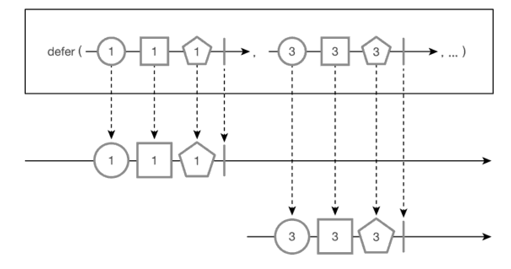

defer() 함수
===
* timer()함수와 비슷하지만 **데이터 흐름 생성을 구독자가 subscribe() 함수를 호출할 때 까지 미룰** 수 있다.
* marblediagram
  
* 마블 다이아 그램을 참고해보면 첫 번째 구독자는 '1'이 적힌 도형들을 수신하고 두번 째 구독자는 '3'이 적힌 도형들을 수신한다.
* 원형
  ```java
  @SchedulerSupport(SchedulerSupport.NONE) // 스케쥴러 없음, 말인 즉 메인스레드에서 실행된다.
  public static <T> Observable<T> defer(
    Callable<? extends ObservableSource<? extends T>> Supplier) { }
* Callable객체 이기 때문에 call() 메서드의 호출을 미룰 수 있다.
* defer() 함수를 활용하면 Subscribe() 함수를 호출할 때의 상황을 반영하여 **데이터 흐름의 생성을 지연하는 효과**를 보여준다.
* 활용
  ```java
  // 별도 index없이 차례로 가져오기 위해 iterator() 함수를 활용
  Iterator<String> colors = Arrays.asList("1", "3", "5", "6").iterator();
  
  @Override
  public void marbleDiagram() {
    Callable<Observable<String>> supplier = () -> getObservable();
    Observable<String> source = Observable.defer(supplier);
  
    source.subscribe(val -> Log.i("Subscriber #1:" + val));
    source.subscribe(val -> Log.i("Subscriber #2:" + val));
    CommonUtils.exampleComplete();
  }
  
  // 번호가 적힌 도형을 발행하는 Observable을 생성합니다.
  private Observable<String> getObservable() {
      if (colors.hasNext()) {
          String color = colors.next();
          return Observable.just( // 색상이 있는 도형들을 발행
            Shape.getString(color, Shape.BALL):
            Shape.getString(color, Shape.RECTANGLE):
            Shape.getString(color, Shape.PENTAGON):
      }
      
      return Observable.empty(); // 다음 색상이 없는 경우 empty 발행 (empty: 아무런 아이템을 발행하지 않고, 완료를 발행하는 Observable을 생성) 
  
  // result:
  // main | value = Subscriber #1:1
  // main | value = Subscriber #1:1-R
  // main | value = Subscriber #1:1-P
  // main | value = Subscriber #2:3
  // main | value = Subscriber #2:3-R
  // main | value = Subscriber #2:3-P
  
> 만약에 defer()함수를 사용하지 않을 경우
* **확인 필요 -> 왜 6은 발행하지 않는지 확인이 필요 (타이밍상 문제인지 확인이 필요하다는 말 -> 직접코드를 짜봐야함 )**
* ```java
  Observable<String> source = getObservable();
  source.subscribe(val -> Log.i("Subscriber #1" + val));
  source.subscribr(val -> Log.i("Subscriber #2" + val));

  // result:  
  // 이미 발행이 싹다 해버렸기 때문에 subscribe() 함수를 호출하면 그때 해당 데이터 흐름을 그대로 발행한다.
  // main | value = Subscriber #1:5
  // main | value = Subscriber #1:5-R
  // main | value = Subscriber #1:5-P
  // main | value = Subscriber #2:5
  // main | value = Subscriber #2:5-R
  // main | value = Subscriber #2:5-P
