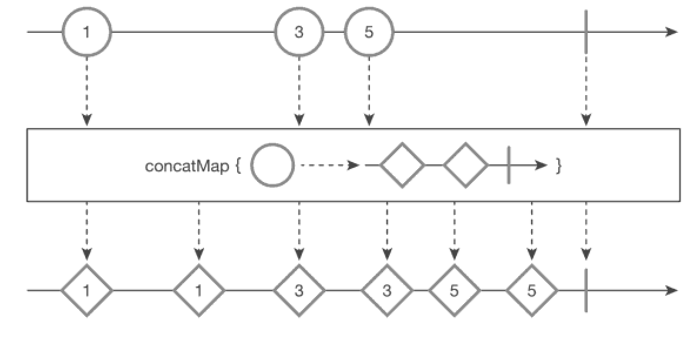

concatMap() 함수
===
* 데이터의 흐름을 변환하는 연산자
* marblediagram
  
* flatMap()
  * 인터리빙(interleaving)발생 : 먼저 들어온 데이터를 처리하는 도중에 새로운 데이터 들어오며 **나중에 들어오는 데이터의 처리 결과가 먼저 출력**될수 있다.
* concatMap()
  * **먼저 들어온 데이터 순서대로 처리해서 결과를 낼 수 있도록 보장**
* ```java
  CommonUtils.exampleStart();
  
  String[] balls = {"1", "3", "5"};
  Observable<String> source = Observable.interval(100L, TimeUnit.MILLISECONDS)
    .map(Long::intValue)
    .map(idx -> balls[idx]
    .take(balls.length)
    .concatMap(ball -> Observable.interval(200L, TimeUnit.MILLSECONDS)
      .map(notUsed -> ball + "◇")
      .take(2)
    );
  source.subscribe(Log::it);
  CommonUtils.sleep(2000);
