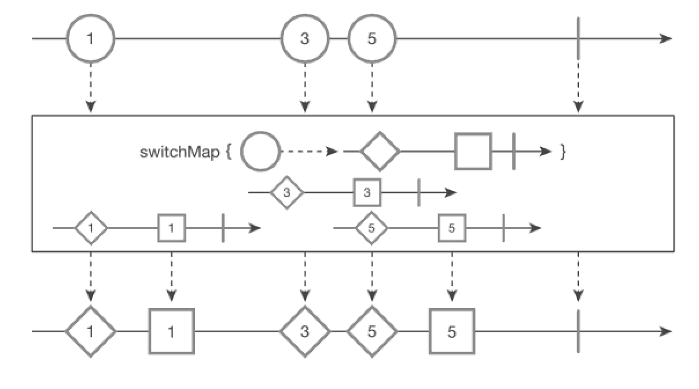

switchMap() 함수
===
* concatMap는 기존 순서대로 전부 작업하면서 시간이 더 오래걸린다. 하지만 switchMap은 순서도 보장해주지만 **기존에 진행 중(발행 중)이던 작업을 바로 중단까지 하는 함수**
* **마지막에 들어온 값만 처리하고 싶을 때 사용**
* marblediagram
  
* 3을 처리하는중 5가 들어와서 3은 더 이상 진행이 되지 않았다.
* ```java
  // CommonUtils.exampleStart();
 
  String[] balls = {"1", "3", "5"};
  Observable<String> source = Observable.interval(100L, TimeUnit.MILLISECONDS)
    .map(Long::intValue)
    .map(idx -> balls[idx]
    .take(balls.length)
    .switchMap(ball -> Observable.interval(200L, TimeUnit.MILLISECONDS)
      .map(notUsed -> ball + "◇")
      .take(2)
    );
  source.subscribe(Log::it);
  CommonUtils.sleep(2000);
  
  // result:
  // RxComputationThreadPool-4 | 685 | value = 5◇
  // RxComputationThreadPool-4 | 884 | value = 5◇
