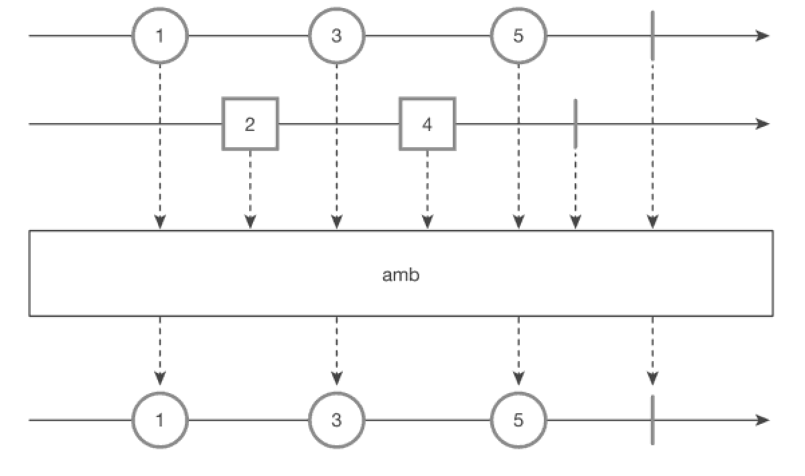

amb() 함수
===
* amb ≒ ambiguous(= 뜻: 모호한)
* **가장 먼저 발행되는 Observable을 선택한다. 후에 발행되는 데이터는 모두 무시**
* 
* ```java
  @SchedulerSupport(SchedulerSupport.NONE)
  public static <T> Observable<T> amb(
    Iterable<? extends ObservableSource<? extends T>> sources)
* ```java
  String[] data1 = {"1", "3", "5"};
  String[] data2 = {"2-R", "4-R"};
  
  List<Observable<String>> sources = Arrays.asList(
    Observable.fromArray(data1)
      .doOnComplete(() -> Log.d("Observable #1 : onComplete()")).
    Observable.fromArray(data2)
      .delay(100L, TimeUnit.MILLISECONDS)
      .doOnComplete(() -> Log.d("Observable #2 : onComplete()"))
  );
  
  Observable.amb(sources)
    .doOnComplete(() -> Log.d("Result : onComplete()"))
    .subscribe(Log::i);
  CommonUtils.sleep(1000);
  
  // result:
  // 2020-12-09 17:34:41.151 3861-3861/com.study.rxandroid I/System.out: main | value = 1
  // 2020-12-09 17:34:41.151 3861-3861/com.study.rxandroid I/System.out: main | value = 3
  // 2020-12-09 17:34:41.151 3861-3861/com.study.rxandroid I/System.out: main | value = 5
  // 2020-12-09 17:34:41.151 3861-3861/com.study.rxandroid I/System.out: main | debug = Observable #1 : onComplete()
  // 2020-12-09 17:34:41.151 3861-3861/com.study.rxandroid I/System.out: main | debug = Result : onComplete()
  
* 100ms 동안 대기후에 발행되는 Observable보다 바로 발행되는 data1 이 더 빠르기 때문에 data1만 출력 data2는 무시되며 종료된다.
      
