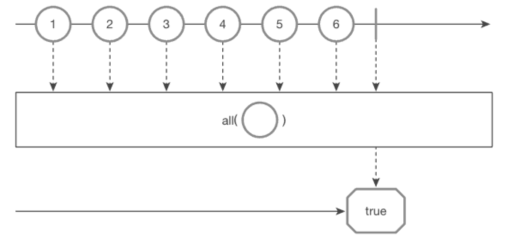

all() 함수
===
* 주어진 조건이 전부 맞으면 true 발행, 아니면 false 발행
* marblediagram
  * 
* all()
  ```java
  @SchedulerSupport(SchedulerSupport.NONE)
  public final Single<Boolean> all(Predicate<? extends T> predicate)
  // predicate 인자는 filter 함수의 인자와 동일
* ```java
  String[] data = {"1", "2", "3", "4"};
  
  Single<Boolean> source = Observable.fromArray(data)
    .map(Shape::getShape)
    .all(Shape.BALL::equals);
    // .all(val -> Shape.BALL.equals(Shape.getShape(val)));
  source.subscribe(Log::i);
  
  // result:
  // 2020-12-12 12:45:14.802 29418-29418/com.study.rxandroid I/System.out: main | value = true
  
  // 만약 String[] data = {"1", "2", "3", "-H"} 라면 false 를 반환한다.
* **메서드 레퍼런스[[자세히 알기::링크]](https://github.com/sdk0213/Knowledge-Storage/blob/master/java/Method%20References.md)**
  * 공통되느 인자를 제거하는 기능으로 축약하여 단순화 할 수 있다.
  * Shape.BALL::equals  ==>  val -> Shape.BALL.equals(Shape.getShape(val))
  * java8 에 제공하는 메서드 레퍼런스 활용
  
