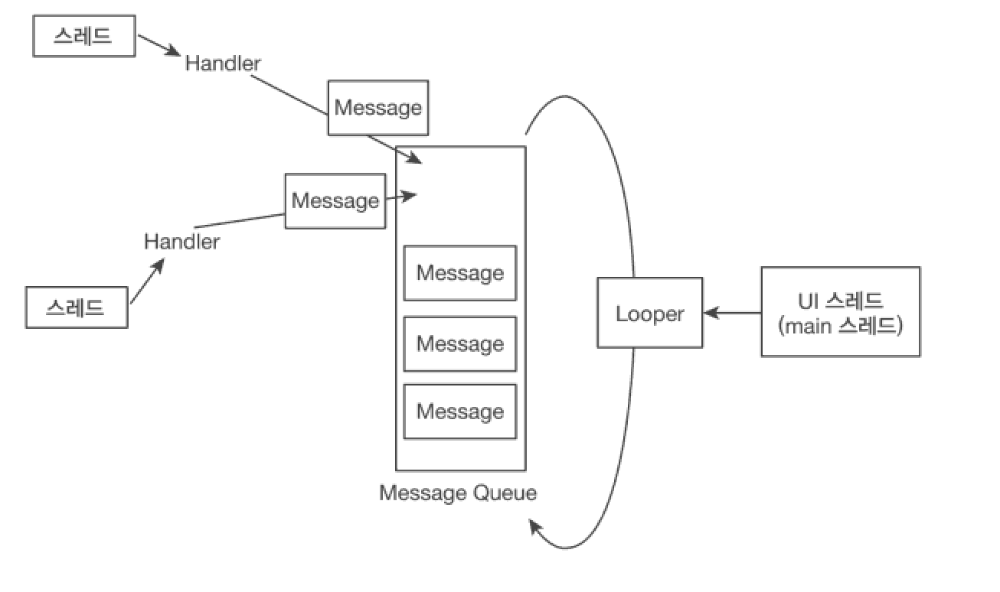

스레드를 대체하는 RxAndroid
===
* 안드로이드는 싱글 스레드 모델이고 UI 업데이트는 UI 스레드에서만 업데이트 가능
* 안드로이드에서 앱의 스레드 설계를 잘못할경우 앱이 멈추거나 속도가 저하되는 현상이 발생되기때문에 고려해서 만들어야 한다.
* 안드로에서는 Looper와 Handler로 뷰를 업데이트 할수 있게끔 제공
* 
* **Handler가 Thread를 생성하고 메시지 객체 넣어져서 메시지 큐에 들어가며 메시지큐에 메시지들은 루퍼가 순서대로 처리한다.**
* 안드로이드 제공해주는 HandlerThread 또는 RxAndroid 에서 제공해주는 AsyncTask(@Deprecated [사망이유](https://medium.com/@prixe87/asynctask-deprecated-대비하기-392f3be5a712)) 클래스도 제공해준다.
* ```java
  private void initAndroidAsync() {
      myAsyncTask = new MyAsyncTask();
      myAsyncTask.execute("Hello", "async", "world");
  }
  
  public class MyAsyncTask extends AsyncTask<String, Void, Stringg> {
      @Override
      protected String dolnBackGround(String... params) {
          StringBuilder word = new StringBulider();
          for(String s : params) {
              word.append(s).append(" ");
          }
          return word.toString();
     }
     
     @Override
     protected void onPostExecute(String result) {
        super.onPostExecute(result);
        mAndroidTextView.setText(result);
     }
  }
* 장점
  * AsyncTask 클래스는 UI 스레드가 아닌 싱글 워커 스레드에서 동작하며 publishProgress()를 이용하여 **실행 중간중간 화면을 바로 갱신한다.**
  * AstncTask 는 앞서 설명된 Handler, Looper의 개념을 몰라도 UI 스레드에 업데이트 할수 있는 **아주 편리한 기능**
* 단점
  * 재사용 불가능(한 번만 사용가능)
  * **엑티비티 종료를 명시안할경우 메모리 누수 가능성 <-- 이것때문에 이제는 deprecated 되어버렸고 구글에서는 사용을 지양하길 권한다**
  * 항상 UI 스레드 위에서 불러와야 한다.
* Process
  

> RxAndroid에서의 구현
* ```java
  private void initRxAsync() {
      Observable.just("Hello", "rx", "world");
        .reduce((x,y) -> x + " " + y)
        .observeOn(AndroidSchedulers.mainThread())
        //  .subscribe(getObserver());
        .subscribe(
          mRxTextView::setText,
          e -> Log.e(TAG, e.getMessage()),
          () -> Log.i(TAG, "done")
        );
  }
  
  private MaybeObserver<String> getObserver() {
      return new MaybeObserver<String>() {
          @Override
          public void onSubscribe(Disposable d) { }
        
          @Override
          public void onSuccess(String result) {
              mRxTextView.setText(result);
          }
          
          @Override
          public void onError(Throwable e) {
              Log.e(TAG, e.getMessage());
          }
          
          @Override
          public void onComplete() {
              Log.i(TAG, "done");
          }
     };
 }

> TimerTask 대체하기
* 안드로이드 Timer 클래스
  * schedule() 메서드를 이용하여 지연 시간이나 특정 시간에 특정 동작을 설정, 반복 실행을 가능케 한다.
* 안드로이드 Handler 클래스
  * postDelayed() 메서드를 이용하여 지연 시간 설정이나 반복 실행 구혀
* ```java
  private int DELAY = 0;
  private int PERIOD = 1000;
  private Timer mTimer = new Timer();
  
  public void timeStart() {
      mTimer.schedulerAtFixedRate(new TimerTask() {
          @Override
          public void run() {
              // 작업 내용
          }
     }, DELAY, PERIOD);
  }
  
  public void timerStop() {
      mTimer.cancel();
  }
 
* Timer 클래스에서 사용할수 있는 메서드로 schedule, scheduleAtFixedRate가 있다.
  * **schedule은 예를들어 30초 실행주기를 설정했을때 실행오차가 발생할수 있는 가능성이 있어 이럴때는 Fixed를 사용해야한다.**
* 실행 횟수 제한은 CountDownTimer 클래스를 사용한다
* 11초동안 1초에 한번씩 count 를 -1 해주는 코드
  ```java
  private static final int MILLISINFUTURE = 11 * 1000;
  private static final int COUNT_DOWN_INTERVAL = 1000;

  CountDownTimer mCountDownTimer;

  private void initCountDownTask() {
      mCountDownTimer = new CountDownTimer(MILLISINFUTURE, COUNT_DOWN_INTERVAL) {
          @Override
          public void onTick(long l) {
              mTextView.setText(String.valueOf(count--));
          }
          
          @Override
          public void onFinish() {
              mTextView.setText("Finish .");
          }
      };
  }
* RxAndroid Timer 클래스를 대체
  * ```java
    public class PollingFragment extends Fragment {
        @BindView(R.id.lv_polling_log)
        ListView mLogView;
        Unbinder mUnbinder;
        
        @Nullable
        @Override
        public View onCreateView(LayoutInflater inflater, @Nullable ViewGroup container, @Nullable Bundle savedInstanceBundle) {
            View layout = inflater.inflate(R.layout.fragment_polling, container, false);
            mUnbinder = ButterKnife.bind(this, layout);
            setupLogger();
            return layout;
        }
        
        // ...
        
        private void startPollingV1() {
            Observable<String> ob = Observable.interval(3, TimeUnit.SECONDS)
              .flatMap(o -> Observable.just("polling #1 " + o.toString()));
              
              ob.subscribeOn(Schedulers.io())
                .observeOn(AndroidSechulder.mainThread())
                .subscribe(this::log);
        }
        
        // ..
        
    }
  * 코드 해석
    * 3초마다 정소를 발생하는 Observable을 생성
    * flatMap 함수로 polling #1 과 발행한 정수를 결합한 새로운 Observable로 변경
    * 쓰레드는 안드로이드 메인쓰레드(UI스레드)로 설정

