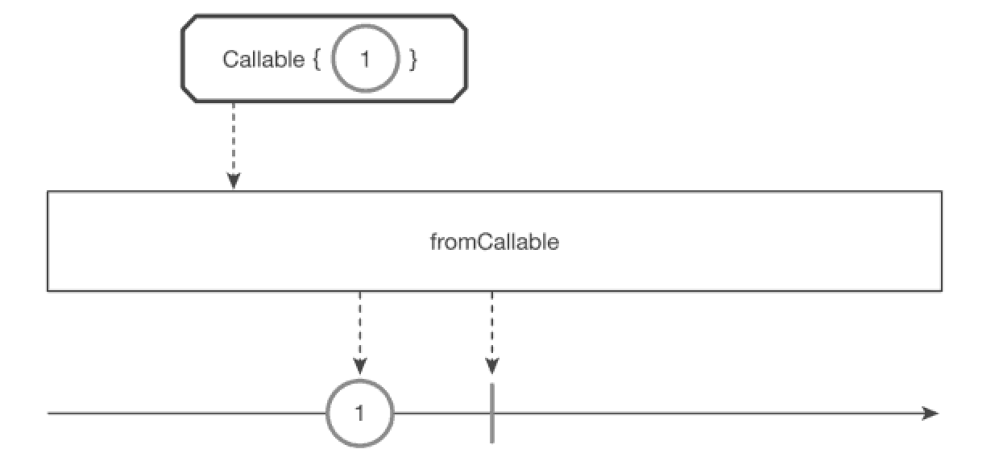
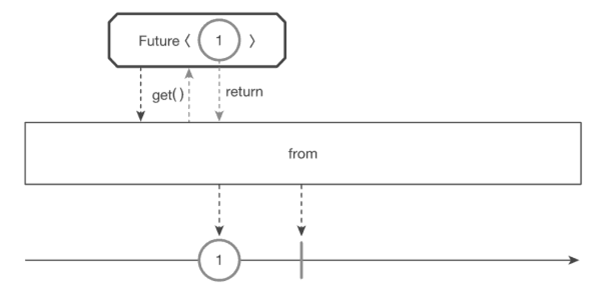

REST API 네트워크 프로그래밍
===
* REST API 는 쉽게 말해서 지원해주는 회사가 있다면 해당 회사가 가지고 있는 데이터를 GET, POST, PUT, DELETE 와 같은 HTTP 메서드를 사용해서 URL로 접근하는 방법이다.
* 더 쉽게 말해 그냥 구글같은곳에서 제공해주는 구글맵이나 구글 드라이브 데이터를 가져올때 API 를 사용하는 방식인데 그게 REST API 이다.
* 특징
  * 모든자원은 URL(고유주소)로 식별
  * HTTP 사용
  * HTTP 메서드 사용
  * JSON, XML 사용
* 
* Volley 사용 - [사용법 정리](https://github.com/sdk0213/Knowledge-Storage/blob/master/Library/Volley.md)
  * **시간정보 얻기 1**
    ```java
    private Observable<JSONObject> getObservable() {
        return Observable.defer(() -> {
            try {
                return Observable.just(getData());
            } catch (InterruptedExcpetion e) {
                log("error : " + e.getMessage());
                return Observable.error(e);
            } catch (ExecutionException e) {
                log("error : " + e.getCause());
                return Observable.error(e.getCause());
            }
        });
    }
    * defer()
      * 비동기 함수
      * supplier(() -> T) 를 매개변수로 사용
      * 데이터 타입은 Callable<? extends OBservableSource<? extends T>>
  * **시간정보 얻기 2**
    ```java
    private Observable<JSONObject> getObservableFormCallable() {
        return Observable.fromCallable(this::getData);
    }
    * fromCallable()
      * 
      * Callable<? extends ?> supplier 를 매개변수로 사용
      * defer() 함수와는 다르 어떠 데이터 타입도 사용 할 수 있다.
      * Future 객체르 직접 전달하지 않고 Future.get() 을 전달한다.
  * **시간정보 얻기 3**
    ```java
    private Observable<JSONObject> getObservableFromFuture() {
        return Observable.fromFuture(getFuture());
    }
    * fromfuture()
      * 
      * Future<? extends T> future를 매개변수를 사용
