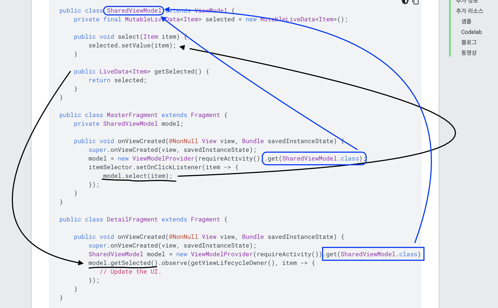
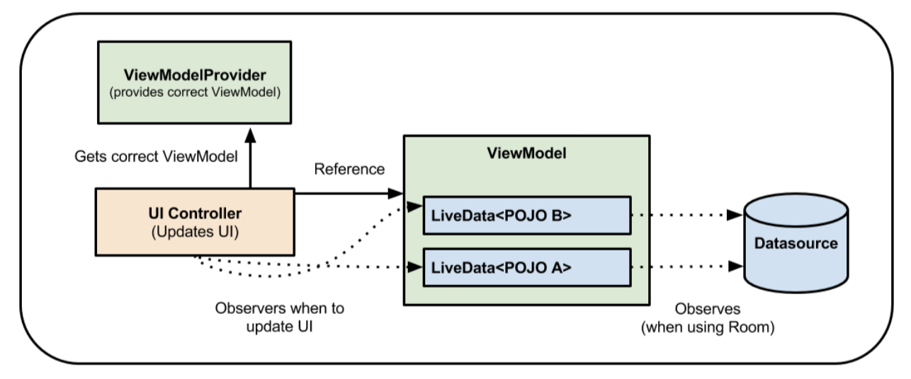

[View Model(뷰 모델)](https://developer.android.com/topic/libraries/architecture/viewmodel?hl=ko#java)
===
* mvvm(Model — View — ViewModel)의 view model에서 파생되었음
  * View가 필요로 하는 데이터만을 소유
* Android Architecture ViewModel의 약자인 AAC ViewModel이라고 부르기도 한다.
* ```java 
  public class MyViewModel extends ViewModel {
    private MutableLiveData<List<User>> users;
    public LiveData<List<User>> getUsers() {
        if (users == null) {
            users = new MutableLiveData<List<User>>();
            loadUsers();
        }
        return users;
    }

    private void loadUsers() {
        // Do an asynchronous operation to fetch users.
    }
  }

  ...
  ..
  public class MyActivity extends AppCompatActivity {
    public void onCreate(Bundle savedInstanceState) {
        // Create a ViewModel the first time the system calls an activity's onCreate() method.
        // Re-created activities receive the same MyViewModel instance created by the first activity.

        MyViewModel model = new ViewModelProvider(this).get(MyViewModel.class);
        model.getUsers().observe(this, users -> {
            // update UI
        });
    }
  }
* 특징
  * ViewModel 객체는 뷰 또는 **LifecycleOwners의 특정 인스턴스화보다 오래 지속**되도록 설계
  * ViewModel을 다루는 테스트를 더 쉽게 작성 가능
  * 수명 주기를 인식하는 Observable의 변경사항을 관찰해서는 안됨
  * Application Context가 필요할경우 AndroidViewModel 클래스를 확장하고 생성자에 Application을 받는 생성자를 포함

> viewmodel 수명주기
* lifecycle
  * 
* 활동에서는 활동이 끝날 때까지 그리고 프래그먼트에서는 프래그먼트가 분리될 때까지 메모리에 남아 있다.
  * ViewModel이 처음 요청되었을 때부터 활동이 끝나고 폐기될 때까지 ViewModel은 존재

> viewmodel을 통한 fragment간 데이터 공유
* ```java
  public class SharedViewModel extends ViewModel {
     private final MutableLiveData<Item> selected = new MutableLiveData<Item>();

     public void select(Item item) { 
         selected.setValue(item);
     }

     public LiveData<Item> getSelected() {
         return selected;
     }
  } 

  public class MasterFragment extends Fragment { 

     public void onViewCreated(@NonNull View view, Bundle savedInstanceState) {
         super.onViewCreated(view, savedInstanceState);
         SharedViewModel model = new ViewModelProvider(requireActivity()).get(SharedViewModel.class);
         itemSelector.setOnClickListener(item -> {
             model.select(item);
         });
     }
  }

  public class DetailFragment extends Fragment {

     public void onViewCreated(@NonNull View view, Bundle savedInstanceState) {
         super.onViewCreated(view, savedInstanceState);
         SharedViewModel model = new ViewModelProvider(requireActivity()).get(SharedViewModel.class);
         model.getSelected().observe(getViewLifecycleOwner(), item -> {
            // Update the UI.
         });
     }
  }
* 

> ViewModel로 로더 전체과정
* room과 livedata를 사용
  * 데이터베이스가 변경되면 Room에서 LiveData에 변경을 알리고, 알림을 받은 LiveData는 수정된 데이터로 UI를 업데이트
* 
* 
