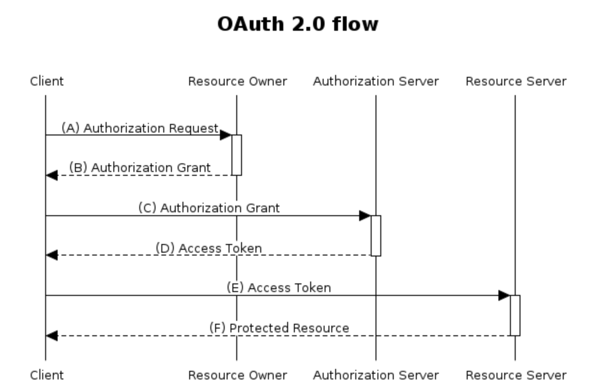

OAuth
===
* 사용자가 소유한 정보가 필요할때(ex: google calender, gmail.. naver email) 해당 리소스 서버에어 인증하는 방식
* 과거에는 직접 리소스 서버에서 아이디와 비밀번호르 가져와서 처리르 하였으나 심각한 보안문제를 일으킬 가능성이 있기 때문에 Oauth가 등장했다.
* 순서1
  * 리소스 서버(구글,네이버..)에 등록해야한다. "우리의 서비스는 당신들 서비스를 사용할것입니."
  * 그러면 리소스 서버에서 return 으로 client Id, client Secret(노출되면안됨) 두 개의 값을 발급해준다. client는 해당 정보를 저장함
  * 그리고 사용자가 클리이언트에 접속할때 안내 메시지를 받는다. "해당 클라이언트에서 당신의 구글 캘린더를 사용할수 있도록 허락해주십시오" 뜨고 허용버튼을 눌러줘야함
  * 사용자가 '허용' 해주었을때는 리소스 서버에서 code라는것을 준다.
  * 받은 code 값 + id + secret 값을 다시 리소스서버에 전송한다.
  * 리소스 서버가 해당값을 비교해서 검증
  * 검증이 완료되었다면 **access token 을 발급**(진짜 비밀번호) 해주는데 이를 클라이언트가 보관해놓음
  * 그리고 access token 을 이용해서 리소스서버에 접속하고 api 사용
* 순서2
  1. Resource Owner(사용자)가 Client(우리 서버)에게 인증 요청을 합니다.
  2. Client는 Authorization Request를 통해 Resource Owner에게 인증할 수단(ex Facebook, Google 로그인 url)을 보냅니다.
  3. Resource Owner는 해당 Request를 통해 인증을 진행하고 인증을 완료했다는 신호로 Authorization Grant를 url에 실어 Client에게 보냅니다.
  4. Client는 해당 권한증서(Authorization Grant)를 Authorization Server에 보냅니다.
  5. Authorization Server는 권한증서를 확인 후, 유저가 맞다면 Client에게 Access Token, Refresh Token, 그리고 유저의 프로필 정보(id 포함) 등을 발급해줍니다. 
  6. Client는 해당 Access Token을 DB에 저장하거나 Resource Owner에게 넘깁니다.
  7. Resource Owner(사용자)가 Resource Server에 자원이 필요하면, Client는 Access Token을 담아 Resource Server에 요청합니다.
  8. Resource Server는 Access Token이 유효한지 확인 후, Client에게 자원을 보냅니다.
  9. 만일 Access Token이 만료됐거나 위조되었다면, Client는 Authorization Server에 Refresh Token을 보내 Access Token을 재발급 받습니다. 
  10. 그 후 다시 Resource Server에 자원을 요청합니다.
  11. 만일 Refresh token도 만료되었을 경우, Resource Owner는 새로운 Authorization Grant를 Client에게 넘겨야합니다. (이는 다시 사용자가 다시 로그인 하라는 말입니다.)
* 흐름 - [부연설명](https://interconnection.tistory.com/76)
  * 
* Access token
  * 수명이 존재한다. 
  * 그래서 다시 지난번의 과정을 해야 하는데 이는 번거로우니까 RefreshToken을 사용한다.
  * RefreshToken
    
    * RefreshToken 을 사용해서 Access Token을 다시 발급받는다.
    * 이때, RefreshToken을 다시 받는 경우도 있고 아닌 경우도 있다.
* [구글에서 OAuth는 모든 플랫폼에 사용되는 Google APIs Client Library 안드로이드에서 사용 가능한 GoogleAuthUtil 로 나뉜다.](https://stackoverflow.com/questions/22142641/access-to-google-api-googleaccountcredential-usingoauth2-vs-googleauthutil-get)
  * |Google APIs Client Library|GoogleAuthUtil|
    |:--:|:--:|
    |If you are developing for some other platform than Android you can not use GoogleAuthUtil as it is an Android specific library.|Using this requires no other libraries or external dependencies than the Google Play Services|
    |If you are developing a cross platform application you can use the Google APIs Client Library in your shared code for for both Android and other platforms.|Your app's footprint should be smaller since you don't have to include additional libraries.|
    |If you interact a lot with many of Google's services this library may make things easier for you.|If your interaction with Google is limited it might be easier to just use the GoogleAuthUtil directly instead of going trough another library.|
    |If you are already using this and it works as wanted there isn't really any drawback to continue using it as it is a wrapper for GoogleAuthUtil so you get all the advantages of GoogleAuthUtil compared to using the AccountManager or some other library based on the AccountManager.|GoogleAuthUtil shouldn't be that hard to use as it is, so using a library that wraps around it to simplify it might not be that much easier to use.
