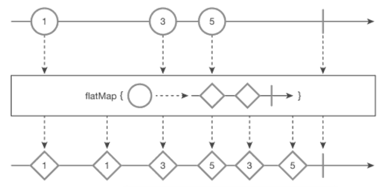

flatMap() 함수
===
* **map**()보다 **진보**된 함수
* **결과값**으로 **Observable**이 나온다.
* marblediagram
  * 
  * 1원을 넣으면 해당 같은 숫자의 두개의 다이아몬드가 나오고 3원, 5원도 동일함
* ```java
  String[] balls = {"1", "3", "5"};
  
  Function<String, Observable<String>> getDoubleDiamonds = // <String, Observable<String>> 제네릭 타입 선언
    ball -> Observable.just(ball + "◇", ball + "◇"); // ball을 두번 발행
  
  Observable<String> source = Observable.fromArray(balls)
    .flatMap(getDoubleDiamonds);

  // lambda
  // Observablw<String> source = Obsercable.fromArray(balls)
  //   .flatMap(ball -> Observable.just(ball + "◇");

  source.subscribe(Log::i);

  // result:
  // main | value = 1◇
  // main | value = 1◇
  // main | value = 3◇
  // main | value = 3◇
  // main | value = 5◇
  // main | value = 5◇

* **이해다 못해도된다** **중요**한것은 Function<String, Observable<String>>에서 String을 넣으면 "여러 개의 String을 발행하는 Observable이 나오는구나" 하는것이다.
* **초반**에는 람다보다는 **함수형 인터페이스 Function**<T, R>으로 **분리**하는것이 좋다.
* **Rxjava**에서 **여러**개의 **데이터**를 발행하는것은 **Observable**밖에 없다


