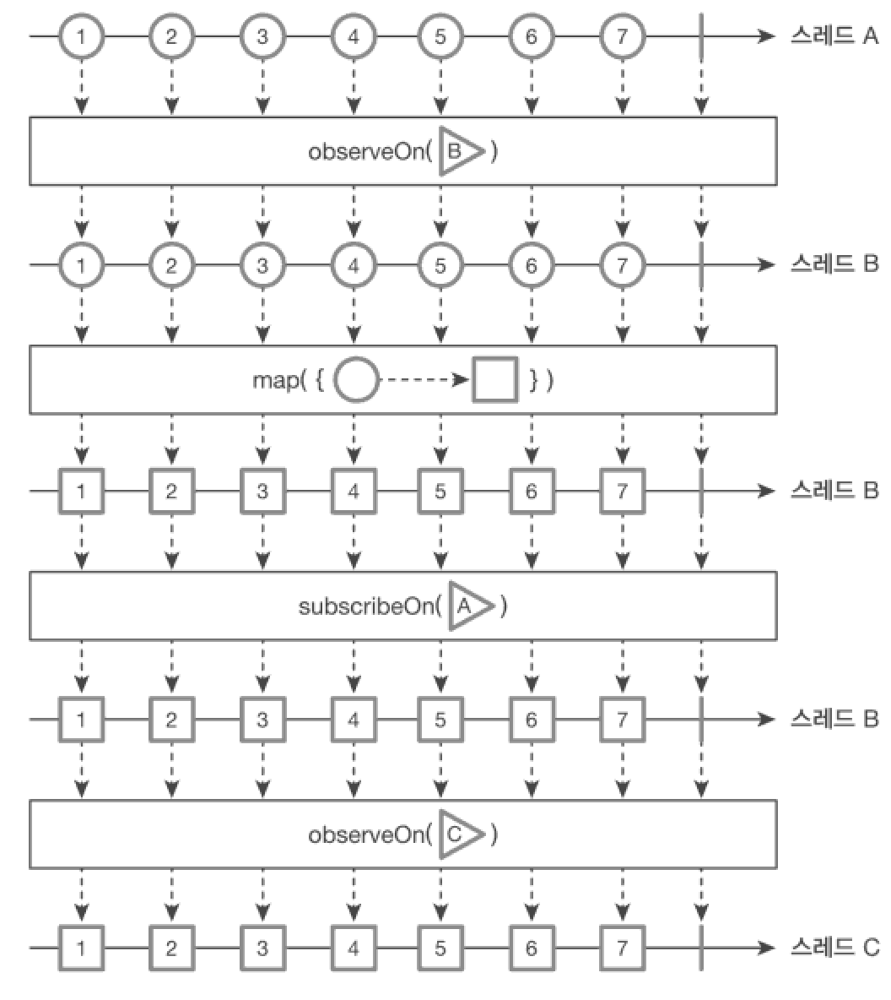

ObserveOn() 활용
===
* subscribeOn -> 데이터 흐름을 발행하는 스레드를 지정
  * 한번 호출했을 때 결정한 스레드를 고정하며 이후에는 다시 호출해도 스레드가 바뀌지 않는다.
* observeOn -> 결과를 구독자에게 전달하는 스레드를 지정
  * 여러 번 호출 가능하며 호출되면 그 다음부터 동작하는 스레드를 바꿀 수 있다.
* 

> OpenWeatherMap 에서 데이터 가져와 온도, 도시, 국가 이름 추출하기
* ```java
  public class OpenWeatherMapV1 {
    private static final String URL =
      "http://api.openweathermap.org/data/2.5/weather?q=London&APPID=";
      
    public void run() {
      Observable<String> source = Observable.just(URL + "API_KEY")
        .map(OkHttpHelper::getWithLog)
        .subscribeOn(Schedulers.io());
     
     // 어떻게 한 번만 호출하 만들 수 있을까?
     Observable<String> temperature = source.map(this::parseTemperature);
     Observable<String> city = source.map(this::parseCityName);
     Observable<String> country = source.map(this::parseCountry);
     CommonUtils.exampleStart();
         
     Observable.concat(temperature, city, country)
       .observeOn(Scehdulers.newThread())
       .subscribe(Log::it);
     CommonUtils.sleep(1000):
    }
    
    private String parseTemperature(String json) { 
  	  	return parse(json, "\"temp\":[0-9]*.[0-9]*");
  	 }

    private String parseCityName(String json) { 
  	  	return parse(json, "\"name\":\"[a-zA-Z]*\"");
  	 }

    private String parseCountry(String json) { 
  	  	return parse(json, "\"country\":\"[a-zA-Z]*\"");
  	 }
	
    private String parse(String json, String regex) { 
    		Pattern pattern = Pattern.compile(regex);
  	  	Matcher match = pattern.matcher(json);
		    if (match.find()) {
      			return match.group();
  		  }
	    	return "N/A";				
  	 }
	
    public static void main(String[] args) { 
		    OpenWeatherMapV1 demo = new OpenWeatherMapV1();
  		  demo.run();
	   }
  }
* Observable을 여러개 생성하고 정보의 취합을 위해 concat함수를 호출하였다. **하지만 원하는 정보가 많을경우 API 호출도 증가할것이다.**
* 해결방법
  ```java
  CommonUtils.exampleStart();

  Observable<String> source = Observable.just(URL + API_KEY)
  		.map(OkHttpHelper::getWithLog)
  		.subscribeOn(Schedulers.io())
  		.share()
  		.observeOn(Schedulers.newThread());
		
  source.map(this::parseTemperature).subscribe(Log::it);
  source.map(this::parseCityName).subscribe(Log::it);
  source.map(this::parseCountry).subscribe(Log::it);
		
  CommonUtils.sleep(3000);
  
  // result:
  // mRxCachedThreadScheduler-1 | debug = OkHttp call URL = http:........................
  // RxNewTh........-1 | ........ "temp":289.95
  // RxNewTh........-2 | ........ "name":"London"
  // RxNewTh........-3 | ........ "country":"GB"
* ConnectableObservable 클래스를 사용한다.
  * ConnectableObservable 클래스는 1개의 Observable을 여러 구독자가 공유하는 방식으로 차가운 -> 뜨거운 Observable로 변환해준다.
  * share() = publish() + refCount() 함수가 합쳐져있는 함수이기때문에 ConnectableObservable 클래스의 publish(), refCount()를 사용하지 않았다.
