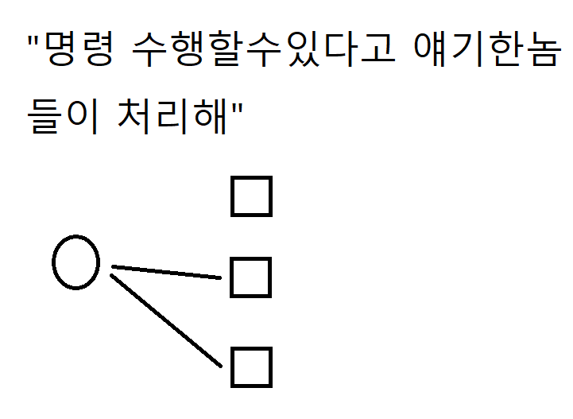

Intent(인텐트) - [출처](https://arabiannight.tistory.com/entry/%EC%95%88%EB%93%9C%EB%A1%9C%EC%9D%B4%EB%93%9CAndroid-%EC%9D%B8%ED%85%90%ED%8A%B8%EB%A5%BC-%EC%82%AC%EC%9A%A9%ED%95%B4-%EB%B3%B4%EC%9E%90-intent-filter)
===

* intent를 보내는 방법에는 다음과 같이 두가지가 있다.
  * 명시적 intent
  * 암시적 intent
  
Intent(명시적 Intent)
---
* 특정 대상을 지정 해놓고 보내는 intent
* 
* 명령
  * ```java
    Intent i = new Intent(FirstrActivity.this, SecondActivity.class);
    startActivity(i);
    ```  
   * BroadCasterReceiver 예제)
     ```xml
     <receiver android:name=".Receivers.HelloLauncher">
       <intent-filter>
         <action android:name="com.hello.application.Receivers.HelloLauncher" />
       </intent-filter>
     </receiver>
     ```
      * setComponent() / setClassNamed()로 인텐트를 생성할 경우 이를 명시적 인텐트라고 부르는게 맞다. - [출처](https://hashcode.co.kr/questions/3700/%EC%95%94%EC%8B%9C%EC%A0%81-%EB%AA%85%EC%8B%9C%EC%A0%81-intent-%EC%A7%88%EB%AC%B8-%EC%9E%88%EC%8A%B5%EB%8B%88%EB%8B%A4)
      * setComponent()로 값을 설정 할 경, action, type, categories와 같은 값은 의미가 없어진다.
      *  action, category 정보가 설정되어 있더라도 setComponent()로 지정된 클 래스가 항상 실행된다.
IntentFilter(암시적 Intent)
---
* 특정 대상을 특정해놓지 않고 보내는 intent
* 
* intentFilter를 받으려는 곳은 다음과 같이 코드를 xml로 작성하여야 한다.
  * ```xml
    <intent-filter>
    <action android:name="arabiannight.tistory.com.intentfilter.secondview">
      <category android:name="android.intent.category.DEFAULT">
      </category>
    </action>
    </intent-filter>
    ```
* 명령
  * ```java
    Intent i = new Intent("arabiannight.tistory.com.intentfilter.secondview");
    startActivity(i);
    ```
 
    
PendingIntent - [출처](https://parkho79.tistory.com/38)
---
* Pending = 보류하는
* 외부 애플리케이션에 내 권한을 허가해서 전달하는 intent.
* 외부 애플리케이션에서 Intent를 동작하도록 하는 방법
* 예를들어 다음과 같은 경우가 있다.
  * 사용자가 Notification 으로 작업을 수행할 때 인텐트가 실행되도록 선언(Android 시스템의 NotificationManager가 인텐트를 실행).
  * 사용자가 AppWidget 으로 작업을 수행할 때 인텐트가 실행되도록 선언(홈 스크린이 인텐트를 실행).
  * 향후 지정된 시간에 인텐트가 실행되도록 선언(Android 시스템의 AlarmManager가 Intent를 실행).
  * 
* 생성하는법 - [출처](https://www.charlezz.com/?p=861)
  * Activity를 시작하는 Intent의 경우 PendingIntent.getActivity()
  * Service를 시작하는 Intent의 경우 PendingIntent.getService()
  * BroadcastReceiver를 시작하는 Intent의 경우 PendingIntent.getBroadcast()
* 사용법 - [출처](https://techlog.gurucat.net/80)
 * ```java
   Intent notificationIntent = new Intent(this, NotificationSomething.class); 
   notificationIntent.putExtra("notificationId", notfi_id); //전달할 값 
   notificationIntent.putExtra("extraString", "Hello PendingIntent"); //전달할 값
   PendingIntent contentIntent = PendingIntent.getActivity(this, 0, notificationIntent, PendingIntent.FLAG_UPDATE_CURRENT); 
   NotificationCompat.Builder builder = new NotificationCompat.Builder(this);
   builder.setContentTitle("상태바 드래그시 보이는 타이틀")  
   .setContentText("상태바 드래그시 보이는 서브타이틀") 
   ... 생략
   .setContentIntent(contentIntent)  // 등록
   ... 생략
   ```
